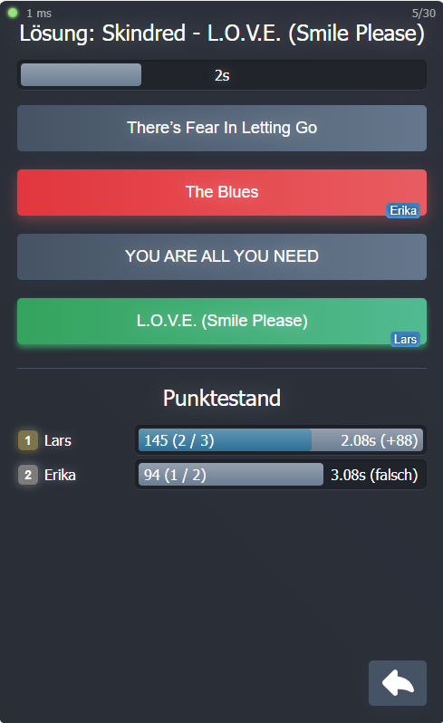
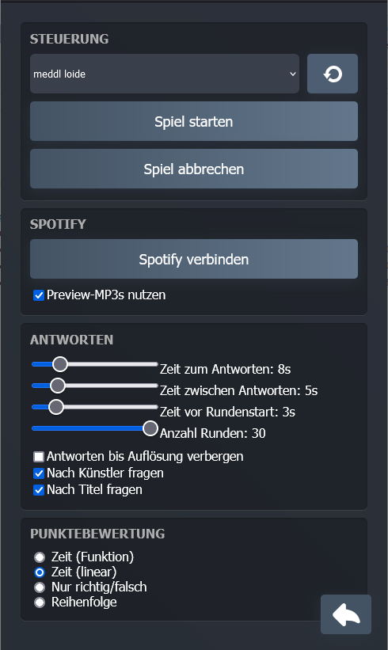

# Music Quiz

Welcome to my fun music guessing game! 
This game can be played in a local network using your browsers as clients.
It uses your Spotify playlists as a source for songs and opens a web server for clients to connect to.
Players will need to correctly select the name or title of the currently played song from provided answers.
Songs are played on the server this application runs on, so it should have speakers that can be heard by all players.
(Obviously this game is intended to be played locally with real people in your room, so you need to meet your friends in real life).
Clients are typically smartphones, but you may use anything that has a (somehow recent) web browser.
 
Enjoy and may the best guesser win!

> **⚠ Important Update: Spotify API Changes (December 2024)**
>
> As of December 2024, Spotify has revoked access to certain API endpoints, including:
> - Preview URLs (used for MP3 playback)
> - Access to "Made For You" playlists directly via the API
>
> ### What does this mean for you?
> - **Disable "Use preview MP3s"**: In the preferences, uncheck the "Use preview MP3s" option as this will not work.
> - **Workaround for "Made For You" playlists**:
    If you wish to play a "Made For You" playlist, create a new, real playlist from its contents within Spotify.
    The newly created playlist will then become accessible on the control page.

 


## Running
### You need
- Spotify Premium
- A PC with speakers
- Some friends to play with (also works with strangers, but you need to grant them access to your local network) [optional]
- One web browser client (=smartphone in most cases) for each player
- The released application (either built from source or downloaded from the Release section)

### How to play
- Start the application with start.bat (or run music-quiz.exe from a command line).
- Open Settings on any client (e.g. browser on host PC) to connect to your spotify account. 
  You usually do not have to this every time as the access token is saved locally.
- Players should open their browser, type in the IP of the host PC into their web browser 
  (if you don't know your IP, open a command line and use `ipconfig` to show your local IP. Usually something like `192.168.X.X`). 
- Select a playlist, set some options and start a round in Settings. You can select from playlists that you follow in Spotify.
- Everything else should be obvious. I guess.

## Building

This app is developed on Windows and powershell scripts are used.
It can be deployed on GNU/Linux, but you probably need to rewrite the scripts with bash commands or execute the stuff in it manually.
Hasn't been tested yet though.

The backend is written in **Rust** while the frontend is written in **Typescript** with **React** as framework. 
This is my first Rust and also Typescript project, so there may be some room for optimizations. 
But it runs quite well, even with over 10 participants. Mostly limited by Wi-Fi bandwidth, make sure there are no
downloads running in the background over Wi-Fi to stop people from complaining and calling you a bad programmer.

**Dependencies:**
- Rust
- [npm](https://docs.npmjs.com/downloading-and-installing-node-js-and-npm)
- whatever I may have forgotten

Put all spotify credentials into `shared/spotify.json` and `shared/spotify_devel.json`. 
Tbh, I am not sure if Spotify has problems with sharing app credentials, 
but as long as you don't use it for any other app you're free to use the ones in this repo.

Use the powershell script `install.ps1` to set up everything for development.

Then compile and start the rust server in debug build with the options
```
-p 8000 -a 127.0.0.1 -s spotify_devel.json
```
This starts the backend locally on port 8000 to handle all API calls.
The redirect URL has port 3000 when developing and 80 in production, thereby different spotify configs are needed. 


Change to the `frontend` directory and start the frontend with
```
npm start
```
This runs the app in the development mode.
Open [http://localhost:3000](http://localhost:3000) to view it in the browser.
The page will reload if you make edits.
You will also see any lint errors in the console.

While developing, routes are first handles by React and forwarded to its configured proxy (localhost:8000 and thereby
to the Rust backend) if React doesn't know the route.
In release build, all routes are served by the Rust application via port 80. 
The rust app has a fallback route that serves non-API-routes with the index.html file.

## Deployment

Run the powershell script
```
release.ps1
```
This compiles the frontend and backend and copies all files to the release folder. 
Take the whole release folder for distribution.
Start the `music-quiz.exe` in some terminal and connect to the IP of the host computer with your clients.

## Wishlist
- Multilanguage support in frontend (currently texts are in German)
- Sorting of playlists in frontend (maybe also show some songs from the playlist)
